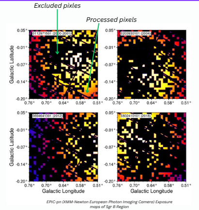

# xmmregion Project

The European Space Agency's (ESA) X-ray Multi-Mirror Mission (XMM-Newton) was launched by an Ariane 504 on December 10th 1999. XMM-Newton is ESA's second cornerstone of the Horizon 2000 Science Programme. It carries 3 high throughput X-ray telescopes with an unprecedented effective area, and an optical monitor, the first flown on a X-ray observatory. The large collecting area and ability to make long uninterrupted exposures provide highly sensitive observations.



Since Earth's atmosphere blocks out all X-rays, only a telescope in space can detect and study celestial X-ray sources. The XMM-Newton mission is helping scientists to solve a number of cosmic mysteries, ranging from the enigmatic black holes to the origins of the Universe itself. Observing time on XMM-Newton is being made available to the scientific community, applying for observational periods on a competitive basis.

Read more about the spacecraft, mirrors and instruments and about the XMM-Newton SOC.


---

## 🚀 Quick Start

### Clone the repository

```bash
git clone git@github.com:Dilru1/xmmregion.git
cd xmmregion
```

### Set up Python environment

```bash
python3 -m venv xmmvenv
source xmmvenv/bin/activate
pip install -r requirements.txt
```

### Run the project

```bash
./main.sh
```

---

## 📁 Project Structure

```
xmmregion/
├── data/                # Data directory
├── 020301020/           # Outputs directory
├── region_utils/        # Python scripts and modules
├── tests/               # Unit tests
├── xmmvenv/             # Python virtual environment
├── main.sh              # Entry point script
├── requirements.txt     # Python dependencies
└── README.md            # Project documentation
```

---

## 📖 Detailed Usage

### Running Tests

Run unit tests to verify project correctness:

```bash
source xmmvenv/bin/activate
python -m unittest discover tests
```

### Customizing Inputs

Data files can be placed or updated inside `data/`.

### Outputs

Outputs are stored in `020301020/` after running `./main.sh`.

---

## 🌐 Documentation

- Detailed documentation available [here](https://Dilru1.github.io/xmmregion)

---

## 🛠 Contributing

Contributions are welcome!

1. Fork this repository
2. Create a new branch: `git checkout -b feature-name`
3. Commit your changes: `git commit -m 'Add new feature'`
4. Push your changes: `git push origin feature-name`
5. Open a pull request

---

## ⚖️ License

MIT © Your Name

